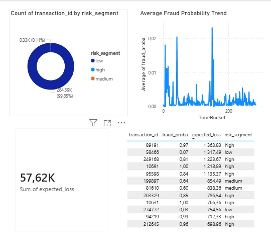
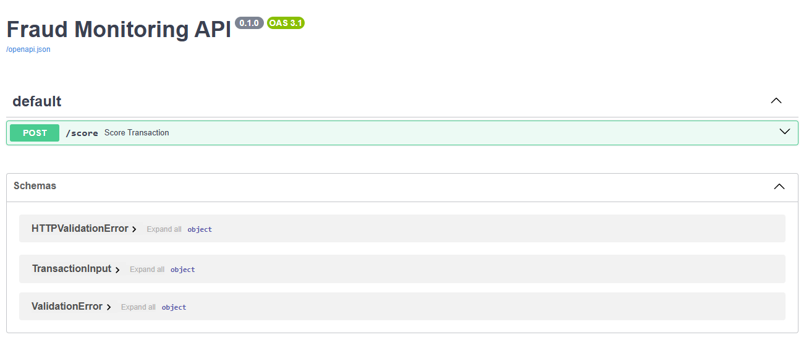
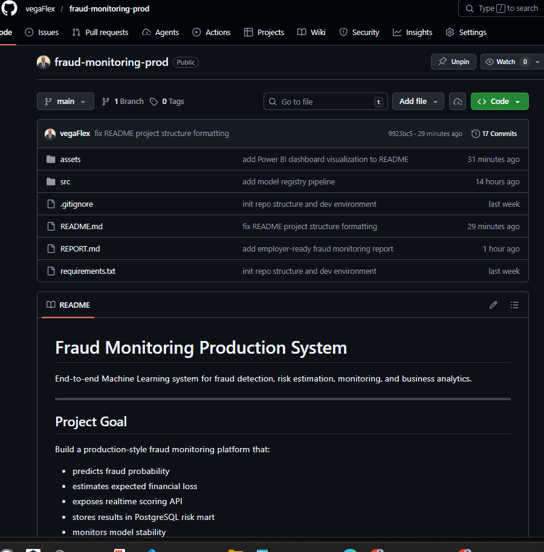

# Fraud Monitoring Production System

Portfolio Project | Production ML System | Risk Analytics

Production-style fraud monitoring platform simulating real-world risk analytics workflow used in fintech and banking environments.

End-to-end Machine Learning system for fraud detection, risk estimation, monitoring, and business analytics.
---

## Project Goal

Build a production-style fraud monitoring platform that:

- predicts fraud probability
- estimates expected financial loss
- exposes realtime scoring API
- stores results in PostgreSQL risk mart
- monitors model stability
- provides Power BI business dashboard

## Business Context

Financial institutions do not only detect fraud — they prioritize financial risk.

This system demonstrates how machine learning predictions are transformed into business decisions through expected loss estimation, monitoring, and analytics dashboards.

---

## Architecture

Pipeline flow:

Data → Features → Model → Scoring API → Database → Monitoring → Power BI

Main components:

- Python ML pipeline
- FastAPI inference service
- PostgreSQL analytics layer
- Monitoring & drift detection
- Power BI dashboard

---

## Tech Stack

Python  
Scikit-learn  
FastAPI  
PostgreSQL  
Pandas  
Power BI

---

## Project Structure

```
fraud-monitoring-prod
│
├── data/
│   ├── raw/
│   └── processed/
│
├── artifacts/
│   └── model.joblib
│
├── assets/
│   └── powerbi_dashboard.png
│
├── notebooks/
│
├── reports/
│   └── REPORT.md
│
├── sql/
│
├── src/
│   └── fraud_monitoring/
│       ├── api/
│       ├── batch/
│       ├── config/
│       ├── db/
│       ├── features/
│       ├── ingest/
│       ├── monitoring/
│       └── train/
│
├── tests/
│
├── .env
├── .gitignore
├── requirements.txt
└── README.md
```

---

## Machine Learning Pipeline

### Step 1 Data Ingestion
- Load OpenML credit card dataset
- Validate schema
- Check fraud rate
- Store raw dataset

### Step 2 Feature Engineering
Created features:

- log transformed amount
- transaction hour
- transaction day
- high amount flag

Output saved as parquet.

---

### Step 3 Model Training

Model:
Logistic Regression baseline fraud model.

Process:

- train test split
- scaling
- model training
- probability prediction
- model serialization using joblib

Artifact saved:

artifacts/model.joblib

---

### Step 4 Batch Fraud Scoring

Daily scoring pipeline:

1 Load features  
2 Apply trained model  
3 Calculate fraud probability  
4 Calculate expected loss  
5 Assign risk segment  
6 Save scores parquet  

Risk segmentation:

- low
- medium
- high

Expected loss formula:

expected_loss = fraud_proba * Amount

---

### Step 5 Realtime Scoring API

FastAPI production endpoint.

Endpoint:

POST /score

Input:
Transaction features.

Output:

{
fraud_proba,
expected_loss,
risk_segment
}

Swagger testing available at:

http://127.0.0.1:8000/docs

---

### Step 6 SQL Risk Mart Layer

PostgreSQL database:

fraud_monitoring

Tables:

- transactions_raw
- features
- scores
- drift_metrics
- model_registry

Power BI reads directly from scores table.

---

### Step 7 Model Monitoring

Implemented monitoring components.

#### Data Drift
Tracks distribution changes:

- amount mean
- amount std
- time mean
- time std

Stored in drift_metrics table.

#### Prediction Drift
Tracks:

- average fraud probability
- probability distribution shift

#### Threshold Alerts
Triggers alerts when:

- expected loss exceeds threshold

Example alert:

ALERT triggered: total_expected_loss exceeded limit

---

### Step 8 Model Registry

Tracks production models.

Stored:

- model version
- model name
- AUC score
- registration timestamp

Supports lifecycle management.

---

## Power BI Dashboard



Business analytics layer.

## API Documentation

Realtime scoring API exposed via FastAPI.



Visualizations:

- KPI total expected loss
- risk segment distribution
- fraud probability trend
- top risky transactions
- monitoring metrics

Business value:
Transforms ML output into executive decision dashboard.

## Project Repository

Full project structure and documentation.


---

## How To Run Project

### Create Environment

python -m venv .venv  
.venv\Scripts\activate  
pip install -r requirements.txt

---

### Train Model

python -m src.fraud_monitoring.train.train_model

---

### Run Batch Scoring

python -m src.fraud_monitoring.batch.score_transactions

---

### Load Scores Into Database

python -m src.fraud_monitoring.db.load_scores_to_db

---

### Start API

uvicorn src.fraud_monitoring.api.main:app --reload

---

### Run Monitoring

Data drift:
python -m src.fraud_monitoring.monitoring.data_drift

Prediction drift:
python -m src.fraud_monitoring.monitoring.prediction_drift

Alerts:
python -m src.fraud_monitoring.monitoring.threshold_alerts

---

## Key ML Metrics

Fraud rate: ~0.17%  
Model type: Logistic Regression  
Output: probability-based risk scoring

---

## What This Project Demonstrates

- End-to-end ML lifecycle
- Production inference API
- Data engineering pipeline
- Monitoring and drift detection
- SQL analytics modeling
- Business intelligence integration
- Risk-based thinking instead of pure modeling

---

## Report

Detailed analytical report available in:

REPORT.md

---
## Skills Demonstrated

Machine Learning lifecycle  
Risk analytics modeling  
Feature engineering  
API development (FastAPI)  
PostgreSQL data modeling  
Production monitoring  
Data drift detection  
Business intelligence (Power BI)  
End-to-end system design

## Author

Veselin Lilov  
Data Analyst | Machine Learning | Risk Analytics